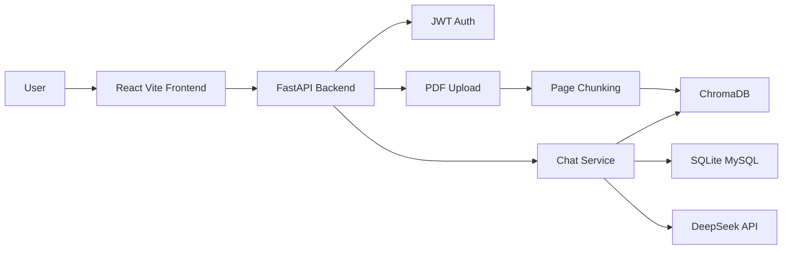

# AI PDF 知识库问答系统展示材料

## 项目定位

这是一个面向个人资料库和课程资料问答的多用户 RAG 应用。用户登录后上传 PDF，系统自动解析、分块、向量化并写入 ChromaDB；提问时检索当前知识库中的相关片段，再调用 DeepSeek API 流式生成回答。

## 核心功能

- 用户注册 / 登录：JWT 鉴权，密码使用 bcrypt 加密。
- 多知识库管理：按用户隔离知识库，支持上传、切换、删除。
- PDF RAG 问答：分页解析 PDF、带 overlap 分块、ChromaDB Top-K 检索。
- 流式聊天：FastAPI StreamingResponse + 前端 ReadableStream。
- 聊天历史：按用户和知识库隔离保存，可清空当前对话。
- 工程化：前后端测试、lint、GitHub Actions CI。

## 技术架构



## 项目亮点

- 解决多用户数据隔离：上传文件、向量库、聊天历史均按 `user_id` 隔离。
- 提升 RAG 可用性：chunk metadata 保存来源文件、页码和 chunk 序号，方便回答追溯。
- 提升稳定性：上传文件名清洗、大小限制、模型调用超时和异常兜底。
- 提升前端体验：组件化拆分，支持多行输入、停止生成、流式渲染节流。
- 提升可维护性：后端按 auth/chat/upload/collections 拆分路由，补充测试和 CI。

## 面试讲解提纲

### 30 秒版本

这是一个多用户 PDF 知识库问答系统。用户上传 PDF 后，后端解析文本并写入 ChromaDB，提问时通过向量检索找相关片段，再调用 DeepSeek 生成流式回答。项目包含 JWT 登录、用户数据隔离、聊天历史、前后端测试和 CI。

### 2 分钟版本

项目采用 React + Vite 前端和 FastAPI 后端。后端登录后返回 JWT，前端请求时带 Bearer Token。上传 PDF 时，后端先做文件名清洗和大小限制，再按页提取文本，使用带 overlap 的分块策略生成 chunk，并将来源文件、页码、chunk 序号作为 metadata 写入 ChromaDB。用户提问时，后端根据当前知识库检索 Top-K 片段，拼接到 prompt 中调用 DeepSeek，并通过 StreamingResponse 返回给前端。为了稳定性，我补了模型异常处理、聊天历史长度限制，以及 pytest、Vitest、ruff、ESLint 和 GitHub Actions。

### 常见追问

- 为什么要分块？
  - PDF 内容可能超过模型上下文，分块后可以按问题检索最相关片段，减少 token 成本并提升回答相关性。
- 怎么做用户隔离？
  - Chroma collection 使用 `u{user_id}_` 前缀，聊天历史表保存 `user_id` 和 `collection`，上传文件按用户目录存储。
- 流式输出怎么实现？
  - 后端使用 DeepSeek 的 stream 模式和 FastAPI `StreamingResponse`，前端通过 `response.body.getReader()` 逐块读取。
- 项目还能怎么扩展？
  - 增加引用来源展示、文档 OCR、Redis 缓存、Docker 部署、权限角色和团队知识库。

## 演示截图建议

将截图放到 `docs/screenshots/`，README 中可引用：

- `login.png`：登录 / 注册页。
- `upload.png`：上传 PDF 后生成知识库。
- `chat.png`：选择知识库并进行 RAG 问答。
- `collections.png`：多知识库切换和删除。

## Cloudflare Tunnel 演示

运行：

```powershell
powershell -ExecutionPolicy Bypass -File scripts/start-demo-cloudflare.ps1
```

脚本会启动后端、前端和 `cloudflared tunnel`。终端中出现的 `https://*.trycloudflare.com` 链接就是临时公网演示地址。

注意：这是临时演示链接，电脑、本地后端、前端和 Tunnel 窗口都必须保持运行。
